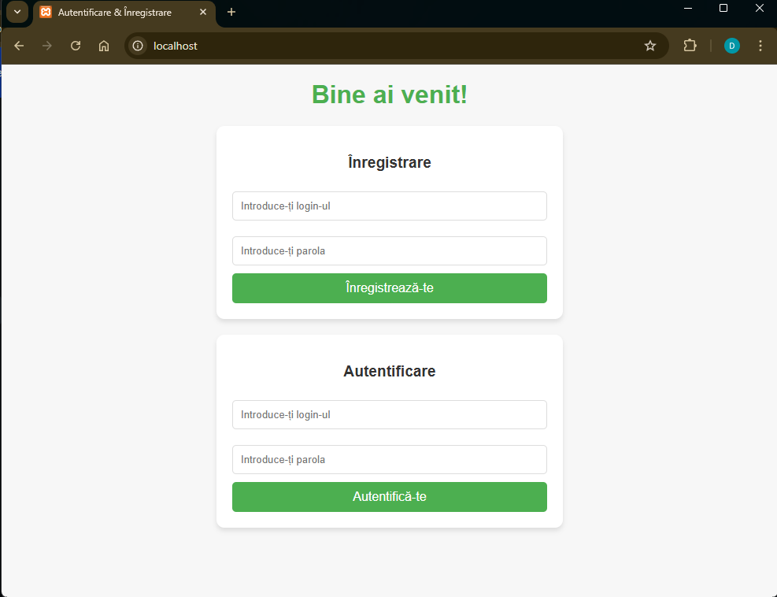

# Darea de Seamă
**Lucrarea de Laborator nr. 6: Interacțiunea Containerelor**

---

## Scopul lucrării
După finalizarea acestei lucrări studentul va fi capabil să gestioneze interacțiunea între mai multe containere.

---

## Sarcina
Creați o aplicație PHP pe baza a două containere: **nginx** și **php-fpm**.

---

## Descrierea executării lucrării

### 1. Structura directoarelor
- Am creat directorul `mounts/site`:
  ```bash
  mkdir -p mounts/site
  ```
- Am copiat site-ul PHP dezvoltat anterior în cadrul cursului **Programare PHP** în directorul `mounts/site`.

### 2. Fișierul `.gitignore`
- În rădăcina proiectului, am creat fișierul `.gitignore` cu următorul conținut:
  ```
  # Ignore files and directories
  mounts/site/*
  ```

### 3. Configurarea nginx
- Am creat fișierul de configurare pentru nginx, `nginx/default.conf`, cu următorul conținut:
  ```nginx
  server {
      listen 80;
      server_name _;
      root /var/www/html;
      index index.php;
      location / {
          try_files $uri $uri/ /index.php?$args;
      }
      location ~ \.php$ {
          fastcgi_pass backend:9000;
          fastcgi_index index.php;
          fastcgi_param SCRIPT_FILENAME $document_root$fastcgi_script_name;
          include fastcgi_params;
      }
  }
  ```

### 4. Crearea și configurarea rețelei interne
- Am creat o rețea **internal** pentru containere:
  ```bash
  docker network create internal
  ```

### 5. Crearea containerului `backend`
- Containerul backend este bazat pe imaginea `php:7.4-fpm` și are proprietățile următoare:
  - Directorul `mounts/site` este montat în `/var/www/html`.
  - Containerul funcționează în rețeaua **internal**.
- Comanda utilizată:
  ```bash
  docker run -d --name backend --network internal -v "$(pwd)mounts/site:/var/www/html" php:7.4-fpm
  ```

### 6. Crearea containerului `frontend`
- Containerul frontend este bazat pe imaginea `nginx:1.23-alpine` și are următoarele configurații:
  - Directorul `mounts/site` este montat în `/var/www/html`.
  - Fișierul `nginx/default.conf` este montat în `/etc/nginx/conf.d/default.conf`.
  - Portul 80 al containerului este expus pe portul 80 al calculatorului gazdă.
  - Containerul funcționează în rețeaua **internal**.
- Comanda utilizată:
  ```bash
  docker run -d --name frontend --network internal -p 80:80 -v "$(pwd)/mounts/site:/var/www/html" -v "$(pwd)/nginx/default.conf:/etc/nginx/conf.d/default.conf" nginx:1.23-alpine
  ```

### 9. Testarea
- Am accesat site-ul în browser la adresa **http://localhost**.


---

## Răspunsuri la întrebări

1. **În ce mod în acest exemplu containerele pot interacționa unul cu celălalt?**
   - Containerele interacționează prin intermediul rețelei **internal** definite în Docker. Containerul `frontend` (nginx) transmite cereri PHP către containerul `backend` (php-fpm) prin protocolul **FastCGI**, folosind numele containerului `backend` ca hostname.

2. **Cum văd containerele unul pe celălalt în cadrul rețelei internal?**
   - În cadrul rețelei **internal**, fiecare container este identificat și accesibil printr-un hostname care corespunde numelui containerului. De exemplu, containerul `frontend` poate accesa `backend` la adresa `backend:9000`.

3. **De ce a fost necesar să se suprascrie configurarea nginx?**
   - A fost necesar să suprascriem configurația nginx pentru a:
     - Direcționa cererile PHP către containerul `backend` folosind **FastCGI**.
     - Configura directorul rădăcină al site-ului (`/var/www/html`) și alte setări specifice proiectului.

---

## Concluzii
Realizând această lucrare, am învățat cum să configurez interacțiunea între două containere folosind o rețea Docker, cum să configurez **nginx** pentru a utiliza FastCGI, și cum să montez directoare și fișiere necesare pentru rularea unei aplicații PHP. Abilitatea de a gestiona mai multe containere este esențială pentru implementarea aplicațiilor distribuite utilizând tehnologii de containerizare.
